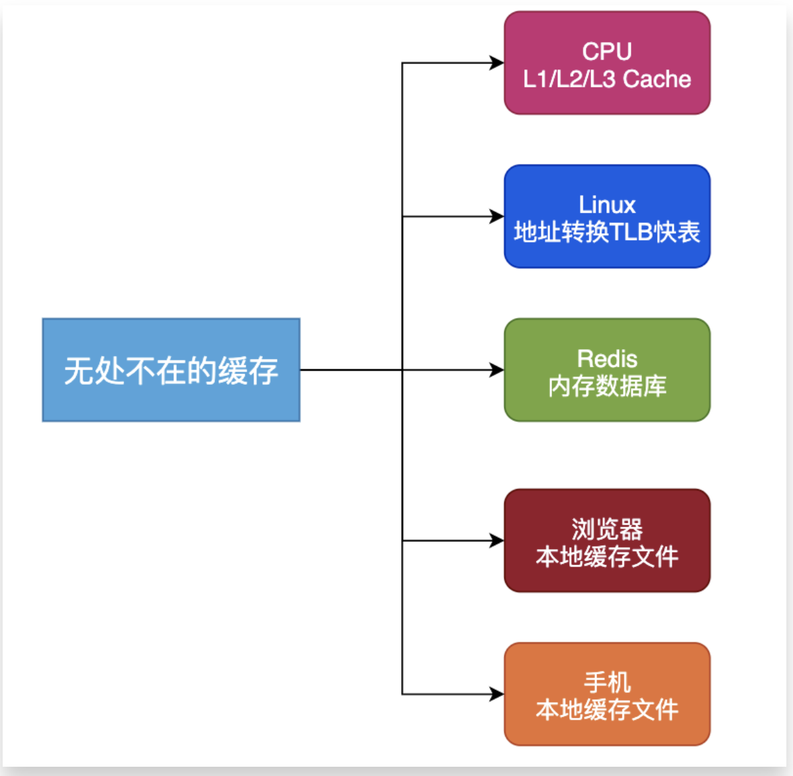

分布式缓存：Redis、Memecached
缓存的好处：读取速度、系统承载能力、
缓存的失效是为了保证与数据源真实的数据保证一致性和缓存空间的有效利用性。
数据一致性：Master与副本一致性、Cache与Storage一致性、业务各维度缓存数据一致性
失效机制：LRU/LFU/FIFO、超时剔除、主动更新
存储机制：懒汉式(读时触发)、饥饿式(写时触发)、定期刷新
缓存穿透、缓存击穿、缓存雪崩：
缓存穿透指查询一个根本不存在的数据，缓存层和存储层都不命中
解决缓存击穿问题：缓存预热、定时更新，直接保存key=NULL，BloomFilter过滤，请求队列控制并发，

缓存雪崩：保证缓存层服务的高可用性、并发控制（依赖隔离组件为后端限流并降级、互斥锁）、项目资源隔离

缓存策略：Cache-Aside、Read-Through、Write-Through、Write-Through

https://mp.weixin.qq.com/s?__biz=MzAxNjM2MTk0Ng==&mid=2247489245&idx=3&sn=0205f0fd8c9aa03fc8d84b4f3a176b57&scene=21#wechat_redirect

- [缓存与数据库的双写一致性](#缓存与数据库的双写一致性)

---------------------------------------------------------------------------------------------------------------------
深入理解分布式缓存设计
https://zhuanlan.zhihu.com/p/55303228
https://juejin.im/entry/57e39e320e3dd90058021bff
https://blog.csdn.net/wang123459/article/details/82114013

分布式缓存
Redis、Memecached

缓存的失效是为了保证与数据源真实的数据保证一致性和缓存空间的有效利用性。

在数据层引入缓存，有以下几个好处：
提升数据读取速度
提升系统扩展能力，通过扩展缓存，提升系统承载能力
降低存储成本，Cache+DB的方式可以承担原有需要多台DB才能承担的请求量，节省机器成本

根据业务场景，通常缓存有以下几种使用方式
懒汉式(读时触发)：写入DB后, 然后把相关的数据也写入Cache
饥饿式(写时触发)：先查询DB里的数据, 然后把相关的数据写入Cache
定期刷新：适合周期性的跑数据的任务，或者列表型的数据，而且不要求绝对实时性

分布式缓存的实现方式
1 数据分片
2 高可用性
3 扩展性（扩缩容）

数据一致性
    我们知道，在CAP理论下，只能取其二，而无法保证全部。在分布式缓存中，通常要保证可用性(A)和可扩展性(P)，并折中采用数据最终一致性，最终一致性包括：
Master与副本一致性
Cache与Storage一致性
业务各维度缓存数据一致性

几种缓存的更新策略：

1、LRU/LFU/FIFO：LRU淘汰最久没有被访问过的，LFU淘汰访问次数最少的，FIFO先进先出。
使用场景：适合内存空间有限，数据长期不变动，基本不存在数据一不致性业务。比如一些一经确定就不允许变更的信息。

2、超时剔除
给缓存数据手动设置一个过期时间，比如Redis expire命令。当超过时间后，再次访问时从数据源重新加载并设回缓存。
使用场景：适合于能够容忍一定时间内数据不一致性的业务，比如促销活动的描述文案。

3、主动更新
如果数据源的数据有更新，则主动更新缓存。
使用场景：对于数据的一致性要求很高，比如交易系统，优惠劵的总张数。

所以总的来说缓存更新的最佳实践是：
低一致性业务：可以选择第一并结合第二种策略。
高一致性业务：二、三策略结合。

缓存穿透、缓存击穿、缓存雪崩：

缓存在计算机系统是无处不在，在CPU层面有L1-L3的Cache，在Linux中有TLB加速虚拟地址和物理地址的转换，在浏览器有本地缓存、手机有本地缓存等

缓存雪崩 Cache Avalanche
缓存穿透 Cache Penetration
缓存击穿  Hotspot Invalid

缓存穿透是指查询一个一定不存在的数据，由于缓存是不命中时被动写的，并且出于容错考虑，如果从存储层查不到数据则不写入缓存，这将导致这个不存在的数据每次请求都要到存储层去查询，失去了缓存的意义。在流量大时，可能DB就挂掉了，要是有人利用不存在的key频繁攻击我们的应用，这就是漏洞。

缓存穿透指查询一个根本不存在的数据，缓存层和存储层都不命中。一般的处理逻辑是如果存储层都不命中的话，缓存层就没有对应的数据。但在高并发场景中大量的缓存穿透，请求直接落到存储层，稍微不慎后端系统就会被压垮。所以对于缓存穿透我们有以下方案来优化。

解决缓存击穿问题：缓存预热、定时更新，直接保存key值为空，BloomFilter过滤，请求队列控制并发，

1、缓存空对象：把不存在的key写一下null
2、布隆过滤器：过滤非法的数据

所以对于这种方案需要做到：第一，做好业务过滤。比如我们确定业务ID的范围是[a, b]，只要不属于[a,b]的，系统直接返回，直接不走查询。第二，给缓存的空对象设置一个较短的过期时间，在内存空间不足时可以被有效快速清除。

缓存击穿  Hotspot Invalid

缓存击穿是这样一种情况：  
由于缓存系统中的热点数据都有过期时间，如果没有过期时间就造成了主存和缓存的数据不一致，因此过期时间一般都不会太长。  
设想某时刻一批热点数据同时在缓存系统中过期失效，那么这部分数据就都将请求磁盘数据库系统。

从描述上来看有点像微小规模的雪崩，但是对数据库的压力就很小了，只不过会影响并发性能，  
然而在多线程场景中缓存击穿却是经常发生的，相反缓存穿透和雪崩频率不如缓存击穿，因此研究击穿的现实意义更大一些。

缓存击穿解决方案：
1. 在设置热点数据过期时间时尽量分散，比如设置100ms的基础值，在此基础上正负浮动10ms，从而降低相同时刻出现CacheMiss的key的数量。
2. 另外一种做法是多线程加锁，其中第一个线程发现CacheMiss之后进行加锁，再从数据库获取内容之后写到缓存中，其他线程获取锁失败则阻塞数ms之后再进行缓存读取，这样可以降低访问数据数据库的线程数，需要注意在单机和集群需要使用不同的锁，集群环境使用分布式锁来实现，但是由于锁的存在也会影响并发效率。
3. 一种方法是在业务层对使用的热点数据查看是否即将过期，如果即将过期则去数据库获取最新数据进行更新并延长该热点key在缓存系统中的时间，从而避免后面的过期CacheMiss，相当于把事情提前解决了。

缓存雪崩：
缓存雪崩：由于缓存层承载着大量请求，有效保护了存储层，但是如果缓存层由于某些原因不能提供服务，于是所有的请求到达存储层，存储层的调用量会暴增，造成存储层级联宕机的情况。预防和解决缓存雪崩问题可以从以下几方面入手。
(1)保证缓存层服务的高可用性，比如一主多从，Redis Sentine机制。
(2)依赖隔离组件为后端限流并降级，比如netflix的hystrix。关于限流、降级以及hystrix的技术设计可参考以下链接。
(3)项目资源隔离。避免某个项目的bug，影响了整个系统架构，有问题也局限在项目内部。

缓存雪崩解决方案
造成缓存雪崩的主要原因是缓存系统不够高可用，因此提高缓存系统的稳定性和可用性十分必要，比如对于使用Redis作为缓存的系统而言可以使用哨兵机制、集群化、持久化等来提高缓存系统的HA。

除了保证缓存系统的HA之外，服务本身也需要支持降级，可以借助比如Hystrix来实现服务的熔断、降级、限流来降低出现雪崩时的故障程度。

热点key重建优化：
开发人员使用"缓存+过期时间"的策略来加速读写，又保证数据的定期更新，这种模式基本能满足绝大部分需求。但是如果有两个问题同时出现，可能会对应用造成致命的伤害。

当前key是一个hot key，比如热点娱乐新闻，并发量非常大。
重建缓存不能在短时间完成，可能是一个复杂计算，例如复杂的SQL, 多次IO，多个依赖等。

当缓存失效的瞬间，将会有大量线程来重建缓存，造成后端负载加大，甚至让应该崩溃。要解决这个问题有以下方案：
1、互斥锁
优化方法：除了重建线程之外，其它线程拿旧值直接返回。比如Google 的 Guava Cache 的refreshAfterWrite采用的就是这种方案避免雪崩效应。

2、永不过期
这种就是缓存更新操作是独立的，可以通过跑定时任务来定期更新，或者变更数据时主动更新。

3、后端限流

缓存无底洞问题
http://ifeve.com/redis-multiget-hole/

缓存雪崩
缓存雪崩是由于原有缓存失效(过期)，新缓存未到期间。所有请求都去查询数据库，而对数据库CPU和内存造成巨大压力，严重的会造成数据库宕机。从而形成一系列连锁反应，造成整个系统崩溃。
(1) 碰到这种情况，一般并发量不是特别多的时候，使用最多的解决方案是加锁排队。
（2）缓存标记：记录缓存数据是否过期，如果过期会触发通知另外的线程在后台去更新实际key的缓存
缓存穿透
　　缓存穿透是指用户查询数据，在数据库没有，自然在缓存中也不会有。这样就导致用户查询的时候，在缓存中找不到，每次都要去数据库再查询一遍，然后返回空。这样请求就绕过缓存直接查数据库，这也是经常提的缓存命中率问题。
（1）解决的办法就是：如果查询数据库也为空，直接设置一个默认值存放到缓存，这样第二次到缓冲中获取就有值了，而不会继续访问数据库，这种办法最简单粗暴。
（2）缓存预热
　　缓存预热就是系统上线后，将相关的缓存数据直接加载到缓存系统。这样避免，用户请求的时候，再去加载相关的数据。
解决思路：
a直接写个缓存刷新页面，上线时手工操作下。
b数据量不大，可以在WEB系统启动的时候加载。
c定时刷新缓存，
（3）缓存更新
缓存淘汰的策略有两种：
　　a定时去清理过期的缓存。
　　b当有用户请求过来时，再判断这个请求所用到的缓存是否过期，过期的话就去底层系统得到新数据并更新缓存。 

大家可以根据自己的应用场景来权衡。1. 预估失效时间 2. 版本号（必须单调递增，时间戳是最好的选择）3. 提供手动清理缓存的接口。

如何实现分布式缓存
https://www.cnblogs.com/yangxiaolan/p/5786123.html
http://blog.csdn.net/singit/article/details/54917884
http://blog.csdn.net/qq_33647837/article/details/69375147
关于缓存雪崩和缓存穿透等问题：http://blog.csdn.net/csdn265/article/details/56012271

解决方案：有很多种方法可以有效地解决缓存穿透问题，最常见的则是采用布隆过滤器，将所有可能存在的数据哈希到一个足够大的bitmap中，一个一定不存在的数据会被 这个bitmap拦截掉，从而避免了对底层存储系统的查询压力。另外也有一个更为简单粗暴的方法（我们采用的就是这种），如果一个查询返回的数据为空（不管是数 据不存在，还是系统故障），我们仍然把这个空结果进行缓存，但它的过期时间会很短，最长不超过五分钟。

布隆过滤器的原理和实现：可以判断一个元素一定不在集合中，不能判断一个元素是否一定在集合中
https://github.com/cpselvis/zhihu-crawler/wiki/%E5%B8%83%E9%9A%86%E8%BF%87%E6%BB%A4%E5%99%A8%E7%9A%84%E5%8E%9F%E7%90%86%E5%92%8C%E5%AE%9E%E7%8E%B0
布隆过滤器（Bloom Filter）的核心实现是一个超大的位数组和几个哈希函数。假设位数组的长度为m，哈希函数的个数为k
首先将位数组进行初始化，将里面每个位都设置位0。对于集合里面的每一个元素，将元素依次通过3个哈希函数进行映射，每次映射都会产生一个哈希值，这个值对应位数组上面的一个点，然后将位数组对应的位置标记为1。
查询W元素是否存在集合中的时候，同样的方法将W通过哈希映射到位数组上的3个点。
如果3个点的其中有一个点不为1，则可以判断该元素一定不存在集合中。反之，如果3个点都为1，则该元素可能存在集合中。注意：此处不能判断该元素是否一定存在集合中，可能存在一定的误判率。

1、布隆过滤器添加元素：
将要添加的元素给k个哈希函数
得到对应于位数组上的k个位置
将这k个位置设为1

2、布隆过滤器查询元素：
将要查询的元素给k个哈希函数
得到对应于位数组上的k个位置
如果k个位置有一个为0，则肯定不在集合中
如果k个位置全部为1，则可能在集合中

---------------------------------------------------------------------------------------------------------------------
缓存策略：Cache-Aside、Read-Through、Write-Through、Write-Through

- Cache-Aside
- Read-Through
- Write-Through
- Write-Through

提高系统性能的最简单也最流行的方法之一其实就是使用缓存。  
我们引入缓存，相当于对数据进行了复制。每当系统数据更新时，保持缓存和数据源（如 MySQL 数据库）同步至关重要，当然，这也取决于系统本身的要求，看系统是否允许一定的数据延迟。

Cache-Aside 策略

Cache-Aside 可能是最常用的缓存策略。在这种策略下，应用程序(Application)会与缓存(Cache)和数据源(Data Source)进行通信，应用程序会在命中数据源之前先检查缓存。

Cache-Aside 策略特别适合“读多”的应用场景。使用 Cache Aside 策略的系统可以在一定程度上抵抗缓存故障。如果缓存服务发生故障，系统仍然可以通过直接访问数据库进行操作。

Read-Through 策略

在 Read-Through 策略下，应用程序无需管理数据源和缓存，只需要将数据源的同步委托给缓存提供程序 Cache Provider 即可。所有数据交互都是通过抽象缓存层完成的。

在进行大量读取时，Read-Through 可以减少数据源上的负载，也对缓存服务的故障具备一定的弹性。如果缓存服务挂了，则缓存提供程序仍然可以通过直接转到数据源来进行操作。

然而，首次请求数据时，总是会导致缓存未命中，并需要额外的时间来将数据加载到缓存中，相信大家都知道怎么处理了吧，还是“缓存预热”的老套路。

Read-Through 适用于多次请求相同数据的场景。这与 Cache-Aside 策略非常相似，但是二者还是存在一些差别，这里再次强调一下：
- 在 Cache-Aside 中，应用程序负责从数据源中获取数据并更新到缓存。
- 而在 Read-Through 中，此逻辑通常是由独立的缓存提供程序支持。

Write-Through 策略

Write-Through 策略下，当发生数据更新(Write)时，缓存提供程序 Cache Provider 负责更新底层数据源和缓存。缓存与数据源保持一致，并且写入时始终通过抽象缓存层到达数据源。

实际上，由于需要将数据同步写入缓存和数据源，因此数据写入速度较慢。但是，当与 Read-Through 配合使用时，我们将获得 Read-Through 的所有好处，并且还可以获得数据一致性保证，从而使我们免于使用缓存失效技术。

Write-Behind 策略

如果没有强一致性要求，我们可以简单地使缓存的更新请求入队，并且定期将其 flush 刷新到数据存储中。

也就是说，Write-Behind 在数据更新时，只写入缓存。优点是数据写入速度快，适用于繁重的写工作负载。与 Read-Through 配合使用，可以很好地用于混合工作负载，最近更新和访问的数据总是在缓存中可用。

它可以抵抗数据源故障，并可以容忍某些数据源停机时间。如果支持批处理或合并，则可以减少对数据源的总体写入，从而减少了负载并降低了成本。

但是，一旦更新后的缓存数据还未被写入数据源时，出现系统断电的情况，数据将无法找回。

参考  
https://juejin.im/post/6844903961078530062  

---------------------------------------------------------------------------------------------------------------------
## 缓存与数据库的双写一致性

[如何保证缓存与数据库的双写一致性？](https://blog.csdn.net/chang384915878/article/details/86756463)

---------------------------------------------------------------------------------------------------------------------

