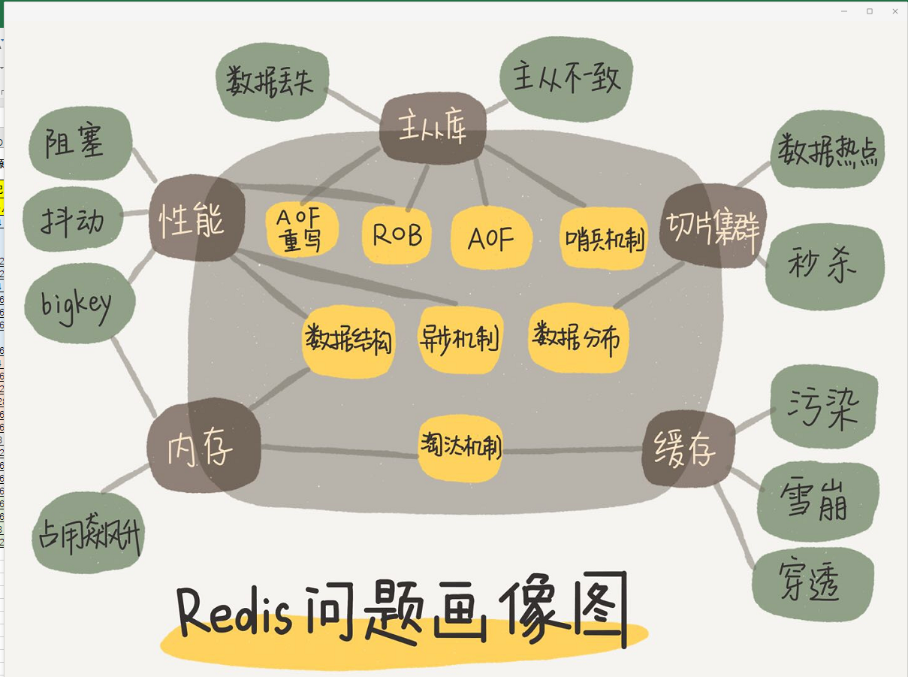

- [批量字节操作Bitmap介绍](Bitmap介绍.md)
- [Redis为什么默认16个数据库](Redis为什么默认16个数据库.md)
- [Redis的最常被问到知识点总结](Redis的最常被问到知识点总结.md)
- [Redis中删除过期Key的三种策略](Redis中删除过期Key的三种策略.md)
- [Redis事务](Redis事务.md)
- [Redis开发建议](Redis开发建议.md)
- [Redis快的秘诀](Redis快的秘诀.md)
- [Redis线程模型](Redis线程模型.md)
- [Redis集群客户端命令](Redis集群客户端命令.md)
    - [redis-cli命令](redis-cli命令.md)
    - Redis命令：Key（键）、String（字符串）、Hash（哈希表）、List（列表）、Set（集合）、SortedSet（有序集合）、Pub/Sub（发布/订阅）、Transaction（事务）

- [安装Install单节点、主从、Sentinel哨兵模式](安装Install单节点、主从、Sentinel哨兵模式.md)
- [LettuceRedis学习](LettuceRedis学习.md)
- [redis.conf配置项说明](redis.conf配置项说明.md)
- [redis集群部署](redis集群部署.md)
    - Redis部署模式：单节点，单节点主从、主从带Sentinel哨兵模式、集群模式
    - Redis集群模式搭建、扩缩容：手动 和 ruby脚本
    - 主从带Sentinel哨兵模式:Sentinel的工作方式
- [Redis集群搭建操作手册](Redis集群搭建操作手册.doc)
- [Redis集群规范](Redis集群规范.md)
- [Redis集群解决方案](#Redis集群解决方案)

- [几款开源的图形化Redis客户端管理软件](几款开源的图形化Redis客户端管理软件.md)
- [零停机Redis迁移实践](零停机Redis迁移实践.md)

- [Redis的五种数据类型的实现是什么数据结构](#Redis的五种数据类型的实现是什么数据结构)
    - Redis支持五种数据类型：string（字符串，byte 数组），hash（哈希，字典，二维结构：数组+链表），list（列表，链表（双向链表）），set（集合，hash table）及zset(sorted set：有序集合，Hash+跳跃表)
- [Redis主从复制机制](#Redis主从复制机制)
- [Linux查看服务安装目录redis](#Linux查看服务安装目录redis)
- [Redis存在的问题](#Redis存在的问题)
    - 缓存雪崩、缓存穿透、缓存预热、缓存更新、缓存降级等问题
- [深挖Redis6.0源码SDS](#深挖Redis6.0源码SDS)
- [Redis集群模式的工作原理：Gossip协议](#Redis集群模式的工作原理：Gossip协议)
- [Redis变慢的常见延迟问题定位与分析](#Redis变慢的常见延迟问题定位与分析)
- [Redis服务端处理流程](#Redis服务端处理流程)
    - Redis服务端处理流程：计算槽、槽节点查找、处理/ASK/MOVED
    - [1.计算槽](#1.计算槽)
    - [2.槽节点查找](#2.槽节点查找)
    - [客户端ASK重定向流程](#客户端ASK重定向流程)
    - [MOVED重定向](#MOVED重定向)
- [Redis集群和zookeeper集群为什么节点数都是奇数](#Redis集群和zookeeper集群为什么节点数都是奇数)
- [Redis中支持RDB和AOF这两种持久化机制](#Redis中支持RDB和AOF这两种持久化机制)
- [Redis提供6种数据淘汰策略](#Redis提供6种数据淘汰策略)
    - Redis提供6种数据淘汰策略 + 版本4.0新增2种
- [Redis和Memcached区别](#Redis和Memcached区别)
    -Redis和Memcached区别：支持数据类型、持久化、数据备份恢复、路由规则、网络IO模型
- [Redis如何解决key冲突](#Redis如何解决key冲突)
    - Redis如何解决key冲突：使用redis的不同db（集群模式部署不行），key带上业务含义
- [如何解决Redis的并发竞争key问题](#如何解决Redis的并发竞争key问题)
    - 如何解决Redis的并发竞争key问题：Redis事务、分布式锁

在实际项目中Redis常被应用于做缓存，分布式锁、消息队列等。

---------------------------------------------------------------------------------------------------------------------

Redis的前世今生
Redis为什么是key，value的，为什么不是支持SQL的？
Redis的NIO&线程模型
redis是多线程还是单线程？
redis 5.x的安装部署方式

[悠闲]新版【分布式锁】理论实践+排除误区
---------------------------------
[玫瑰]什么场景下用分布式锁
[玫瑰]jvm锁和分布式锁是什么关系
[玫瑰]基于redis实现分布式锁的方法
[玫瑰]使用redis分布式锁的tradoff
[玫瑰]使用zookeeper分布式锁的重点思想
[玫瑰]redis V.S zookeeper分布式锁的差异
[玫瑰]分布式锁v.s性能v.s可靠性v.s一致性
[玫瑰]轻便的“重量级分布式锁”是啥？
---------------------------------
[勾引]戳此进直播间啦：https://ke.qq.com/course/399017?taid=10441765576644265&tuin=6c381156

redis为什么是key，value的，为什么不是支持SQL的？
redis是多线程还是单线程？（回答单线程的请回吧，为什么请回，请往下看）
redis的持久化开启了RDB和AOF下重启服务是如何加载的？(10个人9个回答错误)
redis如果做集群该如何规划？AKF/CAP如何实现和设计？
10万用户一年365天的登录情况如何用redis存储，并快速检索任意时间窗内的活跃用户？
redis的5种Value类型你用过几种，能举例吗？
100万并发4G数据，10万并发400G数据，如何设计Redis存储方式？

细节见真知：计算向数据移动、而非数据向计算移动
redis的5大Value类型解析
redis实现活跃用户/用户统计
redis实现秒杀/抢购
redis实现排行榜/评论列表
redis实现推荐系统/抽奖/商品详情页

训练营第二天
linux系统的支持：fork、copy on write
redis的持久化：RDB、AOF、RDB&AOF混合使用
通过redis学AKF划分原则、CAP定理
redis vs zookeeper分布式锁的探索
redis压力测试、调优点

以下这些Redis相关的面试题，你看是不是很眼熟！
1.Redis支持的数据类型？
2.什么是Redis持久化？Redis有哪几种持久化方式？优缺点是什么？
3.Redis 有哪些架构模式？讲讲各自的特点
4.使用过Redis分布式锁么，它是怎么实现的？
5.使用过Redis做异步队列么，你是怎么用的？有什么缺点？
6.什么是缓存穿透？如何避免？什么是缓存雪崩？何如避免？
7.Redis常用命令
8.为什么Redis 单线程却能支撑高并发？
9.说说Redis的内存淘汰策略
10.Redis的并发竞争问题如何解决?

课程第一天：Redis基础+领取课程资料
1.Redis从0到1入门
2.通过Redis操作方式来理解Nosql和RDBMS的不同
3.如何利用Redis支撑十万级并发

课程第二天：Redis项目实战
1.花式炫技，基于Redis打造酷炫功能
2.基于Redis实现直播间聊天室后台支撑系统
3.用Redis实现附近的帅哥美女查询功能

课程第三天：Redis深入进阶
1.教你如何解决Redis数据失效这个巨坑
2.为什么说缓存没用好，友商三两下就击垮你的系统？
3.打造不宕机的Redis高可用服务

---------------------------------------------------------------------------------------------------------------------

## Redis集群解决方案
Redis 的集群解决方案有社区的，也有官方的，社区的解决方案有 Codis 和Twemproxy,
1、官方的集群解决方案就是 Redis Cluster，这是由 Redis 官方团队来实现的。
2、Codis是由我国的豌豆荚团队开源的，
3、Twemproxy是Twitter团队的开源的；

---------------------------------------------------------------------------------------------------------------------
参考
https://blog.csdn.net/men_wen/article/category/6769467
https://github.com/menwengit/redis_source_annotation

分布式缓存Redis使用心得：
https://www.cnblogs.com/yangxiaolan/p/5786123.html

参考
http://redisdoc.com/topic/cluster-tutorial.html
https://juejin.im/post/5c1bb40a6fb9a049f36211b0
http://redisdoc.com/topic/cluster-spec.html

集群中单独运行的节点称为孤儿节点

从redis.conf文件可以看到redis默认有16个数据库，可以通过配置databases来修改这一数字，redis启动连接后会自动选择0号数据库，不过可以SELECT命令更换数据库，每个数据都是独立的，类似数据库

数据类型命令：字符串，list、hashmap、set无序集合、有序集合（sorted set）、KEY 相关命令、事务 和 连接相关命令

## Redis中支持RDB和AOF这两种持久化机制

Redis中支持RDB和AOF这两种持久化机制，目的都是避免因进程退出，造成的数据丢失问题。
RDB持久化：把当前进程数据生成时间点快照（point-in-time snapshot）保存到硬盘的过程，避免数据意外丢失。
AOF持久化：以独立日志的方式记录每次写命令，重启时在重新执行AOF文件中的命令达到恢复数据的目的。

RDB持久化是把当前进程数据生成时间点快照（point-in-time snapshot）保存到硬盘的过程，避免数据意外丢失。
RDB触发机制分为手动触发和自动触发。

手动触发的两条命令：
SAVE：阻塞当前Redis服务器，知道RDB过程完成为止。
BGSAVE：Redis 进程执行fork()操作创建出一个子进程，在后台完成RDB持久化的过程。（主流）

自动触发的配置：
save 900 1 //服务器在900秒之内，对数据库执行了至少1次修改 
save 300 10 //服务器在300秒之内，对数据库执行了至少10修改 
save 60 1000 //服务器在60秒之内，对数据库执行了至少1000修改 
// 满足以上三个条件中的任意一个，则自动触发 BGSAVE 操作 
// 或者使用命令CONFIG SET 命令配置 

AOF的使用：在redis.conf配置文件中，将appendonly设置为yes，默认的为no。

命令写入缓冲区，命令问什么先写入缓冲区
由于Redis是单线程响应命令，所以每次写AOF文件都直接追加到硬盘中，那么写入的性能完全取决于硬盘的负载，所以Redis会将命令写入到缓冲区中，然后执行文件同步操作，再将缓冲区内容同步到磁盘中，这样就很好的保持了高性能。

缓冲区同步到文件
既然缓冲区提供了高性能的保障，那么缓冲区中的数据安全问题如何解决呢？只要数据存在于缓冲区，那么就有丢失的危险。那么，如果控制同步的频率呢？Redis中给出了3中缓冲区同步文件的策略。
虽然Redis提供了三种同步策略，兼顾安全和性能的同步策略是：AOF_FSYNC_EVERYSEC。但是仍有丢失数据的风险，而且不是一秒而是两秒的数据

可配置值	说明
AOF_FSYNC_ALWAYS	命令写入aof_buf后调用系统fsync和操作同步到AOF文件，fsync完成后进程程返回
AOF_FSYNC_EVERYSEC	命令写入aof_buf后调用系统write操作，write完成后线程返回。fsync同步文件操作由进程每秒调用一次
AOF_FSYNC_NO	命令写入aof_buf后调用系统write操作，不对AOF文件做fsync同步，同步硬盘由操作由操作系统负责

我们来了解一下，write和fsync操作，在系统中都做了哪些事：
1、write操作：会触发延迟写（delayed write）机制。Linux在内核提供页缓冲区用来提高IO性能，因此，write操作在将数据写入操作系统的缓冲区后就直接返回，而不一定触发同步到磁盘的操作。只有在页空间写满，或者达到特定的时间周期，才会同步到磁盘。因此单纯的write操作也是有数据丢失的风险。
2、fsync操作：针对单个文件操作，做强制硬盘同步，fsync将阻塞直到写入硬盘完成后返回。

重写机制：当一个数据库的命令非常多时，AOF文件就会非常大，为了解决这个问题，Redis引入了AOF重写机制来压缩文件的体积。

触发机制
手动触发：BGREWRITEAOF 命令。
自动触发：根据redis.conf的两个参数确定触发的时机。 
auto-aof-rewrite-percentage 100：当前AOF的文件空间(aof_current_size)和上一次重写后AOF文件空间(aof_base_size)的比值。
auto-aof-rewrite-min-size 64mb：表示运行AOF重写时文件最小的体积。
自动触发时机 = (aof_current_size > auto-aof-rewrite-min-size && (aof_current_size - aof_base_size) / aof_base_size >= auto-aof-rewrite-percentage)

Redis 复制(Replication)
1. 复制介绍
分布式数据库为了获取更大的存储容量和更高的并发访问量，会将原来集中式数据库中的数据分散存储到多个通过网络连接的数据存储节点上。Redis为了解决单点数据库问题，会把数据复制多个副本部署到其他节点上，通过复制，实现Redis的高可用性，实现对数据的冗余备份，保证数据和服务的高度可靠性。

2. 复制的建立
建立复制的配置方式有三种。
1、在redis.conf文件中配置slaveof <masterip> <masterport>选项，然后指定该配置文件启动Redis生效。
2、在redis-server启动命令后加上--slaveof <masterip> <masterport>启动生效。
3、直接使用 slaveof <masterip> <masterport>命令在从节点执行生效。

Redis的复制拓扑结构支持单层或多层复制关系，从节点还可以作为其他从节点的主节点进行复制。
根据拓扑关系可以分为三种：
一主一从
一主多从（主节点有多个从节点）
树型主从结构（从节点还有子从节点）

主从复制的问题
Redis主从复制可将主节点数据同步给从节点，从节点此时有两个作用：

一旦主节点宕机，从节点作为主节点的备份可以随时顶上来。
扩展主节点的读能力，分担主节点读压力。
但是问题来了：
1、一旦主节点宕机，从节点晋升成主节点，同时需要修改应用方的主节点地址，还需要命令所有从节点去复制新的主节点，整个过程需要人工干预。
2、主节点的写能力受到单机的限制。
3、主节点的存储能力受到单机的限制。
第一个问题，我们接下来讲的Sentinel就可以解决。而后两个问题，Redis也给出了方案Redis Cluster。

Redis Sentinel的高可用
Redis Sentinel是一个分布式架构，包含若干个Sentinel节点和Redis数据节点，每个Sentinel节点会对数据节点和其余Sentinel节点进行监控，当发现节点不可达时，会对节点做下线标识。

如果被标识的是主节点，他还会选择和其他Sentinel节点进行“协商”，当大多数的Sentinel节点都认为主节点不可达时，他们会选举出一个Sentinel节点来完成自动故障转移工作，同时将这个变化通知给Redis应用方。

整个过程完全自动，不需要人工介入，所以可以很好解决Redis的高可用问题。

从上面的逻辑架构和故障转移试验中，可以看出Redis Sentinel的以下几个功能。
1、监控：Sentinel节点会定期检测Redis数据节点和其余Sentinel节点是否可达。
2、通知：Sentinel节点会将故障转移通知给应用方。
3、主节点故障转移：实现从节点晋升为主节点并维护后续正确的主从关系。
4、配置提供者：在Redis Sentinel结构中，客户端在初始化的时候连接的是Sentinel节点集合，从中获取主节点信息。
--------------------- 
作者：men_wen 
来源：CSDN 
原文：https://blog.csdn.net/men_wen/article/details/72724406 
版权声明：本文为博主原创文章，转载请附上博文链接！

## Redis提供6种数据淘汰策略
- volatile-lru：从已设置过期时间的数据集（server.db[i].expires）中挑选最近最少使用的数据淘汰
- volatile-ttl：从已设置过期时间的数据集（server.db[i].expires）中挑选将要过期的数据淘汰
- volatile-random：从已设置过期时间的数据集（server.db[i].expires）中任意选择数据淘汰
- allkeys-lru：从数据集（server.db[i].dict）中挑选最近最少使用的数据淘汰
- allkeys-random：从数据集（server.db[i].dict）中任意选择数据淘汰
- no-enviction（驱逐）：禁止驱逐数据【默认淘汰策略】
 注意这里的6种机制，volatile和allkeys规定了是对已设置过期时间的数据集淘汰数据还是从全部数据集淘汰数据，后面的lru、ttl以及random是三种不同的淘汰策略，再加上一种no-enviction永不回收的策略【默认淘汰策略】。

逐一解释下各个策略
1、volatile-lru，根据最近最少使用算法，淘汰带有 有效期 属性的key及其数据。是4.0版本之前最常选用的策略

2、volatile-random，随机淘汰带有 有效期 属性的key及其数据

3、volatile-lfu，根据最不经常使用算法，淘汰带有 有效期 属性的key及其数据。是4.0版本新增的淘汰机制，个人觉得这种策略会与第1种策略成为两种最佳的选择

4、volatile-ttl，淘汰有效期属性最少的key及其数据，ttl是 Time To Live的缩写

5、allkeys-lru，同样根据最近最少使用算法，但是淘汰范围的key是所有的key

6、allkeys-random，所有key都随机淘汰

7、allkeys-lfu，与第二种的淘汰范围相同，不过使用的算法是最不经常使用算法。同样是4.0版本新增的淘汰机制

8、no-enviction（驱逐）：禁止驱逐数据【默认淘汰策略】

使用策略规则：
1、如果数据呈现幂律分布，也就是一部分数据访问频率高，一部分数据访问频率低，则使用allkeys-lru
2、如果数据呈现平等分布，也就是所有的数据访问频率都相同，则使用allkeys-random

三种数据淘汰策略：
 ttl和random比较容易理解，实现也会比较简单。主要是Lru最近最少使用淘汰策略，设计上会对key 按失效时间排序，然后取最先失效的key进行淘汰

参考  
[redis中maxmemory和淘汰策略](https://www.jianshu.com/p/ca7e15348323)  
[彻底弄懂Redis的内存淘汰策略](https://zhuanlan.zhihu.com/p/105587132)  

## Redis服务端处理流程
 
请求重定向
在集群模式下，Redis接收任何键相关命令时首先计算键对应的槽，再根据槽找出所对应的节点，如果节点是自身，则处理键命令；否则回复MOVED重定向错误，通知客户端请求正确的节点。这个过程称为MOVED重定向
 
 使用redis-cli命令时，可以加入-c参数支持自动重定向，简化手动发起重定向操作
 
 redis-cli自动帮我们连接到正确的节点执行命令， 这个过程是在redis-cli内部维护，实质上是client端接到MOVED信息之后再次发起请求，并不在Redis节点中完成请求转发，如图10-30所示。
 节点对于不属于它的键命令只回复重定向响应，并不负责转发。熟悉Cassandra的用户希望在这里做好区分，不要混淆。正因为集群模式下把解析发起重定向的过程放到客户端完成，所以集群客户端协议相对于单机有了很大的变化。

 键命令执行步骤主要分两步：计算槽，查找槽所对应的节点。下面分别介绍。
### 1.计算槽
 Redis首先需要计算键所对应的槽。根据键的有效部分使用CRC16函数计算出散列值，再取对16383的余数，使每个键都可以映射到0~16383槽范围内。
 
### 2.槽节点查找
 Redis计算得到键对应的槽后，需要查找槽所对应的节点。集群内通过消息交换每个节点都会知道所有节点的槽信息，内部保存在clusterState结构中，结构所示：
 typedef struct clusterState {
     clusterNode *myself; /* 自身节点,clusterNode代表节点结构体 */
     clusterNode *slots[CLUSTER_SLOTS]; /* 16384个槽和节点映射数组， 数组下标代表对应的槽 */
     ...
 } clusterState;
 
 
### 客户端ASK重定向流程
 Redis集群支持在线迁移槽（slot）和数据来完成水平伸缩，当slot对应的数据从源节点到目标节点迁移过程中，客户端需要做到智能识别，保证键命令可正常执行。例如当一个slot数据从源节点迁移到目标节点时，期间可能出现一部分数据在源节点，而另一部分在目标节点，如图10-32所示。
 当出现上述情况时，客户端键命令执行流程将发生变化，如下所示：
 1）客户端根据本地slots缓存发送命令到源节点，如果存在键对象则直接执行并返回结果给客户端。
 2）如果键对象不存在，则可能存在于目标节点，这时源节点会回复ASK重定向异常。格式如下：（error）ASK{slot}{targetIP}： {targetPort}。
 3）客户端从ASK重定向异常提取出目标节点信息，发送asking命令到目标节点打开客户端连接标识，再执行键命令。如果存在则执行，不存在则返回不存在信息。

ASK与MOVED虽然都是对客户端的重定向控制，但是有着本质区别。
ASK重定向说明集群正在进行slot数据迁移，客户端无法知道什么时候迁移完成，因此只能是临时性的重定向，客户端不会更新slots缓存。
但是MOVED重定向说明键对应的槽已经明确指定到新的节点，因此需要更新slots缓存。

### MOVED重定向
Redis客户端可以向集群的任意一个节点发送查询请求，节点接收到请求后会对其进行解析，如果是操作单个key的命令或者是包含多个在相同槽位key的命令，那么该节点就会去查找这个key是属于哪个槽位的。
如果key所属的槽位由该节点提供服务，那么就直接返回结果。否则就会返回一个MOVED错误：
GET x
-MOVED 3999 127.0.0.1:6381
复制代码这个错误包括了对应的key属于哪个槽位（3999）以及该槽位所在的节点的IP地址和端口号。client收到这个错误信息后，就将这些信息存储起来以便可以更准确的找到正确的节点。

当客户端收到MOVED错误后，可以使用CLUSTER NODES或CLUSTER SLOTS命令来更新整个集群的信息，因为当重定向发生时，很少会是单个槽位的变更，一般都会是多个槽位一起更新。因此，在收到MOVED错误时，客户端应该尽早更新集群的分布信息。当集群达到稳定状态时，客户端保存的槽位和节点的对应信息都是正确的，cluster的性能也会达到非常高效的状态。

除了MOVED重定向之外，一个完整的集群还应该支持ASK重定向。

 
 https://blog.csdn.net/HoldBelief/article/details/79796558
 http://blog.jobbole.com/102194/
 
 
 
 

 http://blog.huangz.me/diary/2016/redis-count-online-users.html
 使用 Redis 统计在线用户人数：
方案 1 ：使用有序集合
方案 2 ：使用集合
方案 3 ：使用 HyperLogLog
方案 4 ：使用位图（bitmap）

---------------------------------------------------------------------------------------------------------------------

Redis3.X开始提供集群功能，和哨兵监控功能？？？

Redis支持五种数据类型：string（字符串），hash（哈希），list（列表），set（集合）及zset(sorted set：有序集合)。

Redis 集群的数据分片
Redis 集群没有使用一致性hash, 而是引入了 哈希槽的概念.
Redis 集群有16384个哈希槽,每个key通过CRC16校验后对16384取模来决定放置哪个槽.集群的每个节点负责一部分hash槽,举个例子,比如当前集群有3个节点,那么:
节点 A 包含 0 到 5500号哈希槽.
节点 B 包含5501 到 11000 号哈希槽.
节点 C 包含11001 到 16384号哈希槽.
这种结构很容易添加或者删除节点. 比如如果我想新添加个节点D, 我需要从节点 A, B, C中得部分槽到D上. 如果我像移除节点A,需要将A中得槽移到B和C节点上,然后将没有任何槽的A节点从集群中移除即可. 由于从一个节点将哈希槽移动到另一个节点并不会停止服务,所以无论添加删除或者改变某个节点的哈希槽的数量都不会造成集群不可用的状态.

Redis 集群的主从复制模型:
当某个节点不可用，会造成整个集群不可用（某个节点的master和slave都不可用）

Redis 一致性保证
Redis 并不能保证数据的强一致性. 这意味这在实际中集群在特定的条件下可能会丢失写操作.

下面是一个最少选项的集群的配置文件:
port 7000
cluster-enabled yes
cluster-config-file nodes.conf
cluster-node-timeout 5000
appendonly yes
文件中的 cluster-enabled 选项用于开实例的集群模式， 而 cluster-conf-file 选项则设定了保存节点配置文件的路径， 默认值为 nodes.conf.节点配置文件无须人为修改， 它由 Redis 集群在启动时创建， 并在有需要时自动进行更新。
要让集群正常运作至少需要三个主节点，不过在刚开始试用集群功能时， 强烈建议使用六个节点： 其中三个为主节点， 而其余三个则是各个主节点的从节点。

主从带Sentinel哨兵模式

集群监控哨兵：
参考文章：https://www.cnblogs.com/jaycekon/p/6237562.html

启动Sentinel
/sentinel$ redis-sentinel sentinel.conf

Sentinel的工作方式:
1)：每个Sentinel以每秒钟一次的频率向它所知的Master，Slave以及其他 Sentinel 实例发送一个 PING 命令 
2)：如果一个实例（instance）距离最后一次有效回复 PING 命令的时间超过 down-after-milliseconds 选项所指定的值， 则这个实例会被 Sentinel 标记为主观下线。 
3)：如果一个Master被标记为主观下线，则正在监视这个Master的所有 Sentinel 要以每秒一次的频率确认Master的确进入了主观下线状态。 
4)：当有足够数量的 Sentinel（大于等于配置文件指定的值）在指定的时间范围内确认Master的确进入了主观下线状态， 则Master会被标记为客观下线 
5)：在一般情况下， 每个 Sentinel 会以每 10 秒一次的频率向它已知的所有Master，Slave发送 INFO 命令 
6)：当Master被 Sentinel 标记为客观下线时，Sentinel 向下线的 Master 的所有 Slave 发送 INFO 命令的频率会从 10 秒一次改为每秒一次 
7)：若没有足够数量的 Sentinel 同意 Master 已经下线， Master 的客观下线状态就会被移除。 
若 Master 重新向 Sentinel 的 PING 命令返回有效回复， Master 的主观下线状态就会被移除。

Redis 优势
性能极高 – Redis能读的速度是110000次/s,写的速度是81000次/s 。
丰富的数据类型 – Redis支持二进制案例的 Strings, Lists, Hashes, Sets 及 Ordered Sets 数据类型操作。
原子 – Redis的所有操作都是原子性的，意思就是要么成功执行要么失败完全不执行。单个操作是原子性的。多个操作也支持事务，即原子性，通过MULTI和EXEC指令包起来。
丰富的特性 – Redis还支持 publish/subscribe, 通知, key 过期等等特性。

Redis 是一个高性能的key-value数据库。 redis的出现，很大程度补偿了memcached这类keyvalue存储的不足，在部 分场合可以对关系数据库起到很好的补充作用。它提供了Python，Ruby，Erlang，PHP客户端，使用很方便。

性能测试结果：
SET操作每秒钟 110000 次，GET操作每秒钟 81000 次，服务器配置如下：
Linux 2.6, Xeon X3320 2.5Ghz.
stackoverflow 网站使用 Redis 做为缓存服务器。

Installation
Download, extract and compile Redis with:
$ wget http://download.redis.io/releases/redis-4.0.2.tar.gz
$ tar xzf redis-4.0.2.tar.gz
$ cd redis-4.0.2
$ make
The binaries that are now compiled are available in the src directory. Run Redis with:
$ src/redis-server
You can interact with Redis using the built-in client:
$ src/redis-cli
redis> set foo bar
OK
redis> get foo
"bar"

---------------------------------------------------------------------------------------------------------------------
https://www.jianshu.com/p/3bc684502f20
http://www.importnew.com/26921.html
https://blog.csdn.net/u011489043/article/details/78922390
https://www.biaodianfu.com/redis-vs-memcached.html

## Redis和Memcached区别
1、支持数据类型、
2、持久化
3、数据备份恢复
4、路由规则、
5、网络IO模型：memcached是多线程，非阻塞IO复用的网络模型，redis使用单线程的IO复用模型

1、Redis支持服务器端的数据操作：Redis相比Memcached来说，拥有更多的数据结构和并支持更丰富的数据操作
2、内存使用效率对比：使用简单的key-value存储的话，Memcached的内存利用率更高，而如果Redis采用hash结构来做key-value存储，由于其组合式的压缩，其内存利用率会高于Memcached
3、性能对比：由于Redis只使用单核，而Memcached可以使用多核，所以平均每一个核上Redis在存储小数据时比Memcached性能更高。

---------------------------------------------------------------------------------------------------------------------

## 如何解决Redis的并发竞争key问题
Redis：解决分布式高并发修改同一个Key的问题
 
 https://www.cnblogs.com/yy3b2007com/p/9383713.html
 https://blog.csdn.net/jason1993as/article/details/86850772
 
 1、Redis事务：MULTI + 命令 + EXEC
 2、分布式锁：
 
 
1、Redis事务：MULTI + 命令 + EXEC
  采用使用mutil+watch实现
this.jedis.watch("lock_test");
Transaction tx = this.jedis.multi();
tx.hmset("lock_test", newValues);
List<Object> exec = tx.exec();
 
 
 2、分布式锁的实现方式：
    数据库
    Memcached（add命令）
    Redis（setnx命令）
    Zookeeper（临时节点）
 
 
 通过Jedis的setnx、multi事务及watch实现三种分布式跨JVM锁的方法代码示例
 http://www.xwood.net/_site_domain_/_root/5870/5874/t_c267546.html
 
---------------------------------------------------------------------------------------------------------------------
## Redis如何解决key冲突
1、业务隔离

不同的业务使用不同的redis集群，或者协议使用redis的不同db。

2、良好的Redis Key的设计

格式：业务标识：系统名称：模块名称：关键词简写

比如：保险：用户管理：用户申请：手机号

Redis Key：bx:um:reg:mobile
 
 
 
 
 ---------------------------------------------------------------------------------------------------------------------
## Redis的五种数据类型的实现是什么数据结构

Redis支持五种数据类型：string（字符串，byte 数组），hash（哈希，字典，二维结构：数组+链表），list（列表，链表（双向链表）），set（集合，hash table）及zset(sorted set：有序集合，Hash+跳跃表)
 
Redis的五种数据结构如下：
 String：字符串。byte 数组， 可以包含任何数据
 Hash：字典，二维结构：数组+链表，第一维度:数组，第二维度:链表，哈希表作为字典的底层实现，哈希表使用链表来解决键冲突问题
 List：列表，链表（双向链表）的实现
 Set：集合，通过 hash table 实现的
 Sorted Set：有序集合，Hash+跳跃表，在set的基础上增加了一个标识属性，它可以在set添加或修改元素时指定，每次指定，set会自动按标识调整顺序
 
 
 一、字符串
 Redis使用C语言编写，但是Redis的字符串并没有直接使用C语言传统的字符串，而是自己构建了一种名为简单动态字符串的抽象类型SDS，其本质是个 byte 数组,可以包含任何数据，是二进制安全的。
 
 二、字典
 Redis使用哈希表作为字典的底层实现，每个字典都有两个哈希表，一个平时使用，另一个仅在进行rehash时使用
 哈希表使用链表来解决键冲突问题，被分配到同一个索引上的多个键值对会连接成一个单向链表
  redis存入hash结构时, key, hkey, hvalue 均不能为null
 
 三、列表
 Redis构建了自己的链表的实现，其特性如下：
 1、双端：链表节点提供有prev和next对象,获取某个节点的前置节点和下一个节点的速度为O(1).
 2、无环：表头节点prev对象和表尾节点next对象都指向NULL,链表的访问都是以NULL访问为终点.
 3、带有表头和表尾对象：通过list结构的head和tail，获取表头和表尾对象的速度为O(1).
 4、带有长度计数器：获取链表长度的直接读取len字段值.速度为O(1).
 5、多态：通过dup、free、match三个方法,实现链表的多态,保存不同类型的值

四、集合
Redis 集合是 string 类型的无序集合。set 元素最大可以包含(2 的 32 次方)个元素。set 是通过 hash table 实现的，hash table 会随着添加或者删除自动的调整大小。调整 hash table 大小时候需要同步(获取写锁)会阻塞其他读写操作。

五、有序集合
有序集合(sorted set) 在set的基础上增加了一个标识属性，它可以在set添加或修改元素时指定，每次指定，set会自动按标识调整顺序，set的每一个元素都会关联一个double类型的score。使用时往往我们把要排序的字段作为score存储，对象id则作为元素存储

想想你老家在世界地图中的位置：亚洲-->中国->安徽省->安庆市->枞阳县->汤沟镇->田间村->xxxx号，也是这样一个类似的结构。

「跳跃列表」之所以「跳跃」，是因为内部的元素可能「身兼数职」，比如上图中间的这个元素，同时处于L0、L1和L2层，可以快速在不同层次之间进行「跳跃」。

定位插入点时，先在顶层进行定位，然后下潜到下一级定位，一直下潜到最底层找到合适的位置，将新元素插进去。你也许会问那新插入的元素如何才有机会「身兼数职」呢？

跳跃列表采取一个随机策略来决定新元素可以兼职到第几层，首先L0层肯定是100%了，L1层只有50%的概率，L2层只有25%的概率，L3层只有12.5%的概率，一直随机到最顶层L31层。绝大多数元素都过不了几层，只有极少数元素可以深入到顶层。列表中的元素越多，能够深入的层次就越深，能进入到顶层的概率就会越大。

跳跃表的性质；
1、由很多层结构组成；
2、每一层都是一个有序的链表，排列顺序为由高层到底层，都至少包含两个链表节点，分别是前面的head节点和后面的nil节点；
3、最底层的链表包含了所有的元素；
4、如果一个元素出现在某一层的链表中，那么在该层之下的链表也全都会出现（上一层的元素是当前层的元素的子集）；
5、链表中的每个节点都包含两个指针，一个指向同一层的下一个链表节点，另一个指向下一层的同一个链表节点；

跳跃表搜索的基本原理:
其基本原理就是从最高层的链表节点开始，如果比当前节点要大,比当前层的下一个节点要小，那么则往下找，也就是和当前层的下一层的节点的下一个节点进行比较，以此类推，一直找到最底层的最后一个节点，如果找到则返回，反之则返回空。

 
参考  
https://blog.csdn.net/shengqianfeng/article/details/82684354
https://www.jianshu.com/p/2f4609e0ec6e  

---------------------------------------------------------------------------------------------------------------------
## Redis主从复制机制

Redis的主从复制机制是指可以让从服务器(slave)能精确复制主服务器(master)的数据

主从复制的方式和工作原理
Redis的主从复制是异步复制，异步分为两个方面，
一个是master服务器在将数据同步到slave时是异步的，因此master服务器在这里仍然可以接收其他请求，
一个是slave在接收同步数据也是异步的。

复制方式
Redis主从复制分为以下三种方式：
一、当master服务器与slave服务器正常连接时，master服务器会发送数据命令流给slave服务器,将自身数据的改变复制到slave服务器。
二、当因为各种原因master服务器与slave服务器断开后，slave服务器在重新连上master服务器时会尝试重新获取断开后未同步的数据即部分同步，或者称为部分复制。
三、如果无法部分同步(比如初次同步)，则会请求进行全量同步，这时master服务器会将自己的rdb文件发送给slave服务器进行数据同步，并记录同步期间的其他写入，再发送给slave服务器，以达到完全同步的目的，这种方式称为全量复制。

主从复制的作用
1、保存Redis数据副本
2、读写分离
3、高可用性与故障转移

参考
https://juejin.im/post/5d14bb8ff265da1b602915c5
https://zhuanlan.zhihu.com/p/60239657

---------------------------------------------------------------------------------------------------------------------
## Redis集群和zookeeper集群为什么节点数都是奇数

通过redis-trib.rb可创建redis集群，然后通过--replicas后面接的数字，表示1个主节点对应几个从节点，那么我就做了如下的测试。

想要达到的效果就是有6个节点，然后2个master节点，每个master节点对应2个slave节点，不就正好是6个节点了吗，但是在执行的时候报错：
[aiprd@hadoop2 src]$ ./redis-trib.rb create --replicas 2 192.168.30.10:7000 192.168.30.11:7003 192.168.30.10:7002 192.168.30.10:7001 192.168.30.11:7004 192.168.30.11:7005 >>> Creating cluster *** ERROR: Invalid configuration for cluster creation. *** Redis Cluster requires at least 3 master nodes. *** This is not possible with 6 nodes and 2 replicas per node.  #解释了，对于6个节点，不可能是3个master，每个有2个副本节点。因为，那样的结构需要9个节点。 *** At least 9 nodes are required.  #至少需要9个节点。 

以上信息的意思是：Redis集群至少需要3个master节点，所以现在总共有6个节点，就只能是1master对应1slave这种方式。

所以：
1master-1slave，redis集群需要6个节点
1master-2slave，redis集群需要9个节点，以此类推。

zookeeper集群一般采用3个节点，redis集群一般采用3从3主结构(redis集群没有中心节点，具有线性可伸缩的功能)。

zookeeper：在zookeeper的选举过程中，为了保证选举过程最后能选出leader，就一定不能出现两台机器得票相同的僵局，所以一般的，要求zk集群的server数量一定要是奇数，也就是2n+1台，并且，如果集群出现问题，其中存活的机器必须大于n+1台，否则leader无法获得多数server的支持，系统就自动挂掉。所以一般是3个或者3个以上的奇数节点。

redis：在redis集群中，只有超过一半的节点说某个节点挂掉了，才能确定某个节点挂了。因此redis集群至少要有3个主节点(如果只有两个节点,挂掉一个,剩下一个投票是不会超过50%的,所以最少要三个节点)。

为什么redis推荐奇数个节点
其主要原因还是从成本上考虑的，因为奇数个节点和偶数个节点运行宕机的节点数是一样的，比如3个节点和4个节点都只允许宕机一台，那么为什么要搞4个节点去浪费服务资源呢？

那么话又说回来了，为什么三个节点和四个节点都只允许宕机一个节点呢？这是因为redis规定
集群中，半数以上节点认为主节点故障了，才会选举新的节点

通过上面的分析，想必可以清楚，不管是3个节点还是4个节点，都只能允许一个节点宕机。所以在实际使用过程中出于成本的考虑，一般会建议奇数个节点。
但是：4个节点的性能和容量是比3个节点高的，如果对着方面有要求的，也可以偶数个节点

关于zookeeper为什么推荐奇数个节点还有一个原因是因为脑裂的问题

参考
https://blog.csdn.net/qq32933432/article/details/105785571
https://blog.csdn.net/Lemon_MY/article/details/102488714

---------------------------------------------------------------------------------------------------------------------
## Redis集群模式的工作原理：Gossip协议

Redis Cluster 是一个可以在多个 Redis 节点之间进行数据共享的分布式集群，在服务端，通过节点之间的特殊协议进行通讯，这个特殊协议就充当了中间层的管理部分的通信协议，这个协议称作Gossip流言协议。

Gossip协议的使用
Redis 集群是去中心化的，彼此之间状态同步靠 gossip 协议通信，集群的消息有以下几种类型：
1、Meet 通过「cluster meet ip port」命令，已有集群的节点会向新的节点发送邀请，加入现有集群。
2、Ping 节点每秒会向集群中其他节点发送 ping 消息，消息中带有自己已知的两个节点的地址、槽、状态信息、最后一次通信时间等。
3、Pong 节点收到 ping 消息后会回复 pong 消息，消息中同样带有自己已知的两个节点信息。
4、Fail 节点 ping 不通某节点后，会向集群所有节点广播该节点挂掉的消息。其他节点收到消息后标记已下线。
由于去中心化和通信机制，Redis Cluster 选择了最终一致性和基本可用。

基于Gossip协议的故障检测

集群中的每个节点都会定期地向集群中的其他节点发送PING消息，以此交换各个节点状态信息，检测各个节点状态：在线状态、疑似下线状态PFAIL、已下线状态FAIL。

自己保存信息：当主节点A通过消息得知主节点B认为主节点D进入了疑似下线(PFAIL)状态时,主节点A会在自己的clusterState.nodes字典中找到主节点D所对应的clusterNode结构，并将主节点B的下线报告添加到clusterNode结构的fail_reports链表中，并后续关于结点D疑似下线的状态通过Gossip协议通知其他节点。

一起裁定：如果集群里面，半数以上的主节点都将主节点D报告为疑似下线，那么主节点D将被标记为已下线(FAIL)状态，将主节点D标记为已下线的节点会向集群广播主节点D的FAIL消息，所有收到FAIL消息的节点都会立即更新nodes里面主节点D状态标记为已下线。

最终裁定：将 node 标记为 FAIL 需要满足以下两个条件：
1、有半数以上的主节点将 node 标记为 PFAIL 状态。
2、当前节点也将 node 标记为 PFAIL 状态。

也就是说当前节点发现其他结点疑似挂掉了，那么就写在自己的小本本上，等着通知给其他好基友，让他们自己也看看，最后又一半以上的好基友都认为那个节点挂了，并且那个节点自己也认为自己挂了，那么就是真的挂了，过程还是比较严谨的。

集群版Redis和Gossip协议
https://cloud.tencent.com/developer/article/1444057
https://zhuanlan.zhihu.com/p/72629038
https://juejin.im/post/5dd65d676fb9a05a9a22ac6f

https://juejin.im/post/6844904002098823181  
https://developer.aliyun.com/article/768536  

---------------------------------------------------------------------------------------------------------------------

## Linux查看服务安装目录redis

如果用命令 which redis 或者 whereis redis 都找不到安装目录，

可使用以下办法:
ps -aux | grep redis 
或者ps -ef|grep redis

假如得到了进程号 16678然后用命令
ll /proc/16678/cwd

---------------------------------------------------------------------------------------------------------------------
## Redis存在的问题

缓存雪崩、缓存穿透、缓存预热、缓存更新、缓存降级等问题

Redis知识点
https://mp.weixin.qq.com/s/eVh4LwdMqBNPGW5NLSMNnA
https://zhuanlan.zhihu.com/p/98077080
https://www.cnblogs.com/hzcya1995/p/13290188.html

---------------------------------------------------------------------------------------------------------------------
## 深挖Redis6.0源码SDS

简单动态字符串（Simple Dynamic Strings，SDS）是Redis的基本数据结构之一，用于存储字符串和整型数据。
SDS兼容C语言标准字符串处理函数，且在此基础上保证了二进制安全。

数据结构的基本操作不外乎增、删、改、查，SDS也不例外。

创建字符串
Redis通过sdsnewlen函数创建SDS。在函数中会根据字符串长度选择合适的类型，初始化完相应的统计值后，返回指向字符串内容的指针，根据字符串长度选择不同的类型：

释放字符串
SDS提供了直接释放内存的方法—sdsfree，该方法通过对s的偏移，可定位到SDS结构体的首部，然后调用s_free释放内存：

拼接字符串
拼接字符串操作本身不复杂，可用sdscatsds来实现，

SDS还为上层提供了许多其他API，篇幅所限，不再赘述。表2-1列出了其他常用的API，读者可自行查阅源码学习，学习时把握以下两点。
1）SDS暴露给上层的是指向柔性数组buf的指针。
2）读操作的复杂度多为O(1)，直接读取成员变量；涉及修改的写操作，则可能会触发扩容。

本章小结
本章介绍了SDS的数据结构及基本API的实现。在源码分析过程中，我们可以知道SDS的以下特性是如何实现的。
1）SDS如何兼容C语言字符串？如何保证二进制安全？
SDS对象中的buf是一个柔性数组，上层调用时，SDS直接返回了buf。由于buf是直接指向内容的指针，故兼容C语言函数。而当真正读取内容时，SDS会通过len来限制读取长度，而非“0”，保证了二进制安全。
2）sdshdr5的特殊之处是什么？
sdshdr5只负责存储小于32字节的字符串。一般情况下，小字符串的存储更普遍，故Redis进一步压缩了sdshdr5的数据结构，将sdshdr5的类型和长度放入了同一个属性中，用flags的低3位存储类型，高5位存储长度。创建空字符串时，sdshdr5会被sdshdr8替代。
3）SDS是如何扩容的？
SDS在涉及字符串修改处会调用sdsMakeroomFor函数进行检查，根据不同情况动态扩容，该操作对上层透明。

参考
https://developer.aliyun.com/article/723377
https://github.com/doocs/source-code-hunter/blob/master/docs/Redis/redis-sds.md

---------------------------------------------------------------------------------------------------------------------
## Redis变慢的常见延迟问题定位与分析

[Redis变慢的常见延迟问题定位与分析](http://kaito-kidd.com/2020/07/03/redis-latency-analysis/)

1. 使用复杂度高的命令
2. 存储bigkey
3. 集中过期
4. 实例内存达到上限
5. fork耗时严重
6. 绑定CPU
7. AOF配合不合理
8. 使用Swap
9. 网卡负载过高

---------------------------------------------------------------------------------------------------------------------

